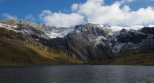

One can always wish for the perfect weather, yet most of the times, it remains a wish. Not this time.

There is a National Trust recommendation to visit Llyn Idwal, which Nora[^1] spotted, and they were right about the place: it's magnificent. We really weren't expecting snow on the mountains in May, but that, combined with the clouds and the late afternoon sunshine was just perfect.

I cropped the image, but apart from that, it really looked like this. No edits, no nothing.

[^1]: https://norahamucska.eu
